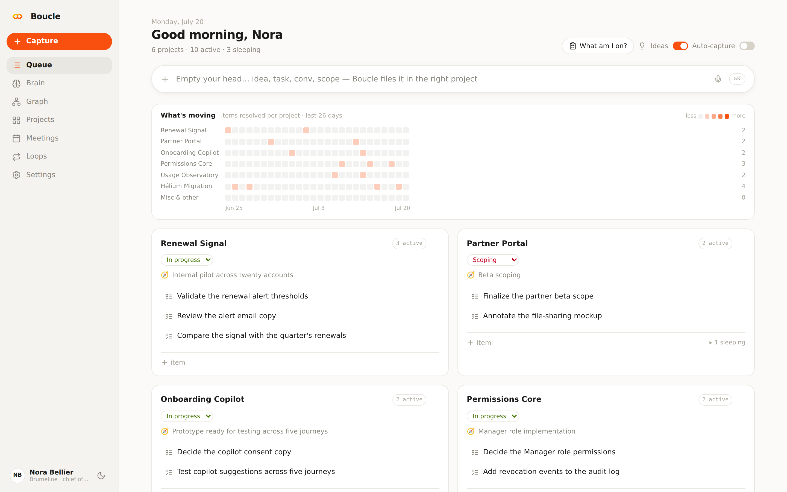

# Mistral Boucle

Mistral Boucle is a local chief-of-staff loop rebuilt on the Mistral stack. Voxtral captures voice, Vibe CLI running Devstral executes recurring loops, and the Agents API powers chats in the browser. It runs against a fully synthetic brain: no real brain or ticket data is sent to Mistral.

The open parts of the stack—Vibe CLI, Devstral and Voxtral weights, and this repository—can be Apache-2.0 and self-hosted.



## Architecture

| Part | Mistral product | Model | Role |
|---|---|---|---|
| Loop runner | Vibe CLI | `devstral-2512` | Runs agentic loops against Boucle's local MCP tools |
| Browser chats, smart capture, enrich | Agents API | `mistral-medium-3.5` | Creates conversations and relays local tool calls |
| Capture routing | Agents API | `ministral-8b-2512` | Handles cheap classification |
| Voice capture | Voxtral batch transcription | `voxtral-mini-latest` | Transcribes short recordings at $0.003/min |
| Voice output (stretch) | Voxtral TTS | `voxtral-mini-tts-latest` | Reads a queue briefing aloud |
| Brain | Local Markdown + SQLite | — | Keeps the demo dataset fully synthetic |

## Quickstart

Create `.env` at the repository root (it is gitignored):

```dotenv
BOUCLE_PORT=4419
BOUCLE_DB=/Users/you/.mistral-boucle/boucle.db
BOUCLE_BRAIN_DIR=/absolute/path/to/mistral-boucle/fake-brain
MISTRAL_API_KEY=your_key_here
```

Install dependencies and start the API:

```sh
pnpm install
pnpm --dir web install
node src/server.ts
```

In another terminal, start the web app at `http://localhost:4320`:

```sh
pnpm --dir web dev
```

## Budget guardrails

The demo has a hard $40 credit budget. Every Vibe run is capped at `$0.25` and 30 turns; loops ship disabled and use intervals of at least 60 minutes when enabled. Run cost is recorded and totaled in the Loops view. The server warns at $10 cumulative spend and refuses new runs at $30, preserving demo-day margin. Expected development spend is roughly $10–15.
